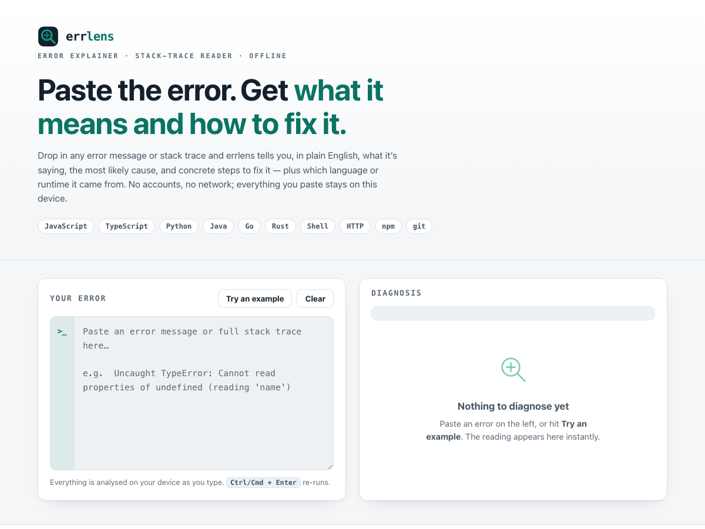

# errlens

**Paste the error. Get what it means and how to fix it.** A calm diagnostic console for programming errors. Drop in any error message or stack trace and errlens tells you, in plain English, what it's saying, the most likely cause, and concrete steps to fix it — plus which language or runtime it came from. 100% client-side, zero dependencies, works fully offline.

## Why

Every developer hits the same wall: a wall of red text that means *something*, but you have to stop, copy it, and go searching to find out what. Most explainers want you to paste your errors — and sometimes your stack traces and file paths — into someone else's server.

errlens is deliberately small and private. Paste the error and it matches the text against a hand-written library of common, real errors, then shows a **plain-English reading**: what the message means, the **most likely causes** (amber), and **numbered steps to fix it** (the signal path). It parses the stack trace to surface the **error type** and the **top frame**, and it ranks matches so the most specific one wins — a distinctive line like `ECONNREFUSED` beats a vague word like `undefined`. When it doesn't recognise your exact message, it says so honestly and gives clearly-labelled general guidance instead of guessing.

## Features

- **Many languages and runtimes** — JavaScript & TypeScript (Node and the browser), Python, Java, Go, Rust, Bash/shell, HTTP status codes, and common **npm** and **git** errors.
- **Reads the whole stack trace** — it extracts the error type from the top and the first location frame, and uses the full text to rank matches.
- **Ranked by specificity** — every entry scores by its most distinctive matching signature, so the *most likely* diagnosis is shown first, with other possibilities one click away.
- **Cause vs. fix, cleanly separated** — the likely causes and the concrete, checkable fix steps are laid out so you can act, not just read.
- **Honest fallback** — no match? errlens looks for signal words (timeout, out of memory, connection reset, encoding…) and offers general guidance, plainly labelled as *not* an exact match. It never fabricates a fix it isn't sure of.
- **Instant and local** — analysis runs as you type, entirely on your device. Nothing is uploaded, logged, or stored.
- **100% offline** — no accounts, no network calls, no tracking. Download it once and it runs with no connection at all.

## Quickstart

Just open `index.html` in any modern browser — no build step, no server, no install.

- **Local:** double-click `index.html`, or run a static server in the folder.
- **Hosted:** **[Open errlens live](https://sreenivas-sadhu-prabhakara.github.io/errlens/)**

Paste an error, or hit **Try an example** to see a diagnosis immediately.

## Privacy

- A strict Content-Security-Policy sets `connect-src 'none'`: the app **cannot** make any network request, even if it tried.
- No external fonts, scripts, images, or analytics. Everything is self-contained in the page's own files.
- All matching runs in your browser. The error text, stack traces, and file paths you paste are **never** transmitted or stored anywhere but your own device — the page keeps nothing after you close it.
- Because there are no network dependencies, it keeps working offline — download it once and it runs with no connection at all.

## Disclaimer

errlens is a **debugging aid, not authoritative advice**. Its explanations cover common cases and may be incomplete or wrong for your exact situation; a "most likely" reading is a **starting point, not a guarantee**, and the general-guidance fallback is explicitly heuristic. It is **not** a substitute for the official documentation of your language, framework, or tools. Always verify a fix against your own code and the authoritative docs before relying on it. This software is provided under the MIT License, "as is", without warranty of any kind; the authors accept no liability for any loss, damage, or broken build arising from its use.

## License

[MIT](./LICENSE) © 2026 Sreenivas Sadhu Prabhakara
